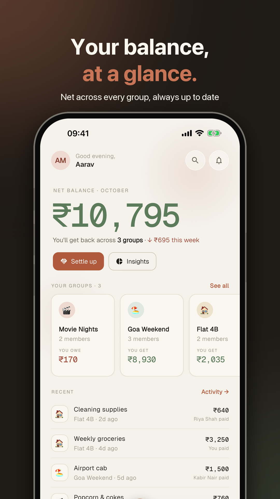
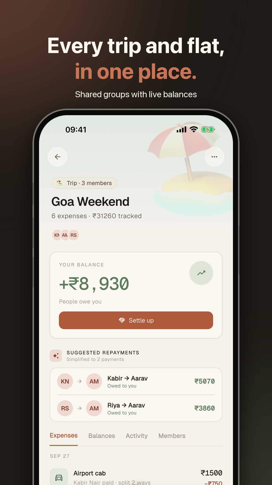
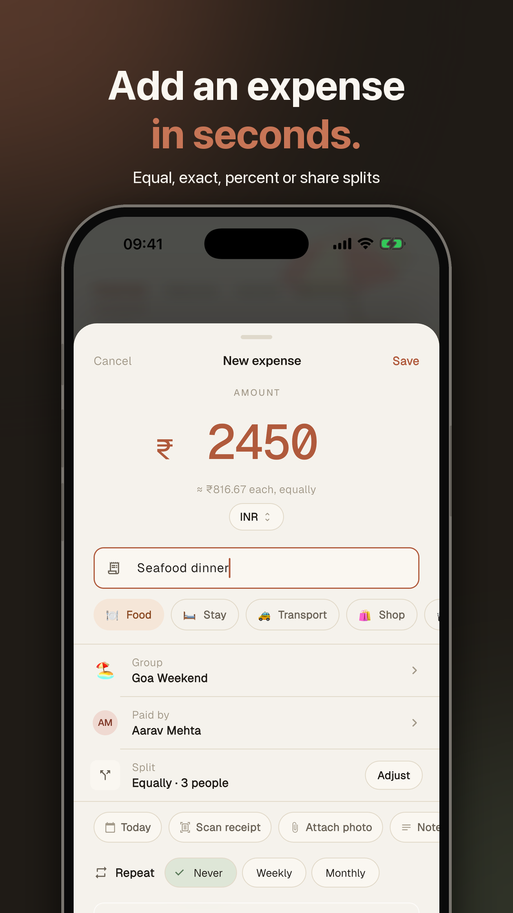
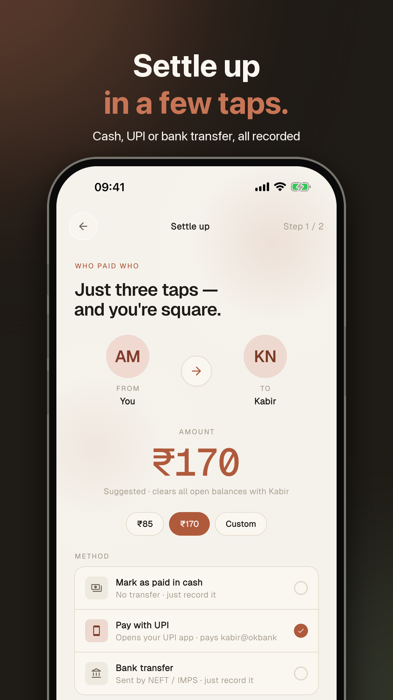
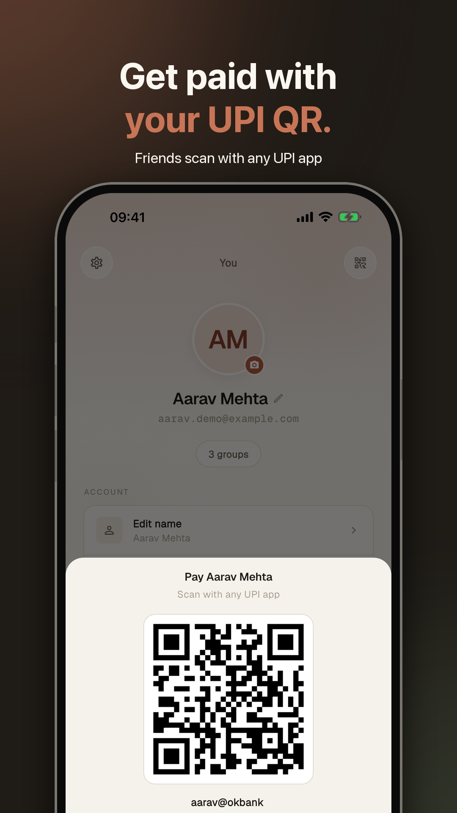
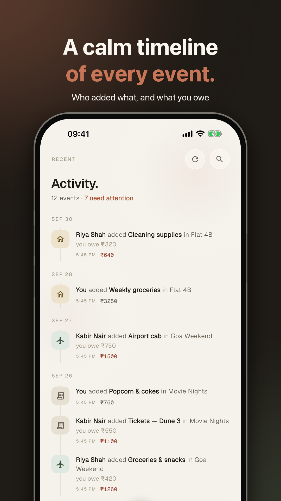
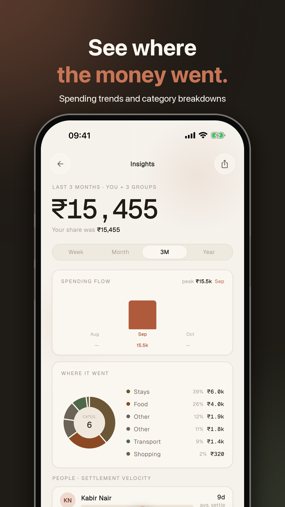
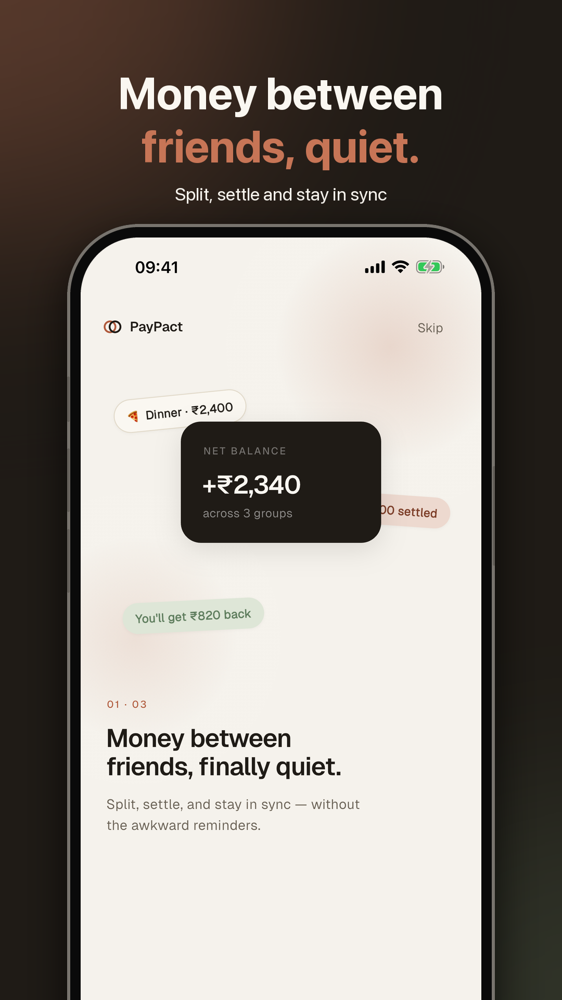

<p align="center">
  
</p>

# PayPact

Shared expenses with smart debt simplification. Flutter app (iOS, Android, web)
on Firebase's **free Spark plan**: Auth, Firestore and Hosting only — no Cloud
Functions, Cloud Storage or Cloud Messaging (see [Running on the free plan](#running-on-the-free-plan)).

## Screenshots

<table>
  <tr>
    <td></td>
    <td></td>
    <td></td>
    <td></td>
  </tr>
  <tr>
    <td></td>
    <td></td>
    <td></td>
    <td></td>
  </tr>
</table>

Captured on an iPhone 17 Pro Max simulator against the local Firebase emulators
with sample data (see [Trying signed-in flows without touching production](#trying-signed-in-flows-without-touching-production)).
Play Store assets (icon, feature graphic, framed screenshots) live in
[`store/play-store/`](store/play-store).

## What's in the app

- **Groups & expenses** — create groups, add expenses (equal / exact / percent /
  shares splits, multi-currency with a snapshot exchange rate), edit and delete.
- **Settle up** — the fewest payments that square everyone up, recorded as an
  immutable ledger entry with a receipt.
- **Invites** — every group has a secret invite code behind a shareable link and
  QR (`https://paypact-fec8e.web.app/invite/CODE`, `paypact://invite/CODE`).
  The code unlocks a small public preview (`invites/{code}`); joining is a
  write the security rules accept only for the caller themselves with a valid code.
- **Roles** — admins edit/delete the group and manage members and roles. You
  can't remove someone, or leave, while you have an unsettled balance; the last
  admin can't leave a group that still has other members.
- **Notifications** — in-app inbox plus device notifications raised from it (see
  below). Settings (settlements, expenses, smart nudges, weekly digest) and
  per-group mute are stored on the account and honoured by whoever is notifying you.
- **Insights, activity, home dashboard** — totals across groups are converted to
  your default currency (Settings → Currency). Search spans groups, expenses and
  people; Insights and Settings can export CSV / JSON.
- **Richer expenses** — back-dated entries, notes, receipt photos (with on-device
  scanning that pre-fills the amount, description and date), comments, an edit
  history, recurring expenses (weekly / monthly), per-group custom categories,
  and delete-with-undo. Photos are stored as Firestore documents. Payments can be reversed by the person who was paid.
- **Paying people** — add a UPI ID in Profile to show a payment QR and let friends
  pay via their UPI app from the settle-up screen.
- **Account & privacy** — App Lock (Face ID / fingerprint), crash reports and
  opt-in analytics, data export, and full account deletion.
- **Languages** — English and Hindi (Settings → Language); navigation, sign-in,
  search, settings and privacy are translated so far.

## Running on the free plan

The Spark plan has no server-side code, so everything a backend would do runs in
the app, guarded by `firestore.rules`:

| Was (Blaze) | Now |
|---|---|
| Cloud Storage for photos | Photos are re-encoded to ≤ 700 KB JPEGs and stored as documents (`users/{uid}/photos/avatar`, `groups/{id}/photos/…`). A reference like `fsimg:<path>#<version>` sits where a URL used to. |
| Group balances/totals (triggers) | The writer of an expense or settlement updates the group's running summary in the same batch (`group_summary.dart`); *Recalculate* rebuilds it from the full history. |
| Invite lookup / join (callables) | `invites/{code}` + a rules-checked self-join. |
| People search (callable) | A public `directory/{uid}` entry per account: name for prefix search, a *hash* of the e-mail for exact lookup. The `users` collection stays unlistable. |
| Account / group deletion | Done step by step by the app (leave groups, clear personal documents, delete the sign-in). Deleting a group empties it first; the ledger can only be removed once the group is marked `deleting`. |
| Recurring expenses (daily job) | Created by whichever member opens the app first after one is due, in a transaction so it can't be done twice. |
| Weekly digest (schedule) | Written to the person's own inbox when the app is opened and a week has passed. |
| Push (FCM) | **Live inbox → local notifications**, below. |

### Notifications without push

Whoever causes an event writes a document to the affected person's
`users/{uid}/notifications`. `InboxWatcher` listens to that collection and raises
a local notification for anything unread and not yet shown (remembered per
account). Delivery timing depends on the platform:

- **App open or recently used:** immediate, from the live listener.
- **Android, app closed:** a WorkManager job checks about every 15 minutes
  (`BackgroundInbox`), so notifications arrive late but do arrive.
- **iOS, app closed:** nothing can run in the background without a push service,
  so notifications appear when the app is next opened. (Real push needs a server
  to send it — the Blaze plan's Functions, or any small always-on service holding
  a Firebase service account.)
- **Web:** the in-app inbox only.

Other limits to know about: recurring expenses and the digest wait for someone
to open the app; summaries are maintained by clients (an admin can *Recalculate*
if two people edit the same expense at the very same moment); name search lets
signed-in users page through the directory's names (e-mail addresses are never
readable).

## Layout

```
lib/
  l10n/            ARB files (en, hi) + generated localizations
  core/            DI (get_it), router + auth guard, services, utils
  design_system/   tokens, theme, shared components
  features/<name>/ domain (entities, repositories) · data (Firestore) · presentation (cubits, screens)
  widgets/         shared atoms (avatars, amounts, chips)
rules_test/        Firestore security-rules tests (run against the emulator)
firestore.rules    security rules
web/invite/        static landing page for invite links
functions/         unused on the free plan (the former Cloud Functions backend,
                   kept only for reference; safe to delete)
```

State management is `flutter_bloc` (cubits); repositories are interfaces with
Firestore implementations registered in `lib/core/di/injection_container.dart`.

## Run it

```bash
flutter pub get
flutter run                      # pick a device
```

Firebase is already configured in `lib/firebase_options.dart`.

> The iOS build uses CocoaPods (`enable-swift-package-manager: false` in
> `pubspec.yaml`) because Swift Package Manager breaks on project paths that
> contain a space. Once the project lives in a path without spaces you can
> remove that setting.

## Tests

```bash
flutter test                                   # Dart unit + widget tests
cd rules_test && npm install && npm test       # Firestore security rules (emulator)
```

The rules tests start the Firestore emulator themselves (needs Java and
`firebase-tools`). CI (`.github/workflows/ci.yml`) runs both.

### Trying signed-in flows without touching production

```bash
firebase emulators:start --project paypact-fec8e   # Auth + Firestore
flutter run -d chrome --dart-define=USE_EMULATORS=true
# Android emulator: add --dart-define=EMULATOR_HOST=10.0.2.2
```

Sign up with any email/password — it exists only in the emulator.

### Localization

Strings live in `lib/l10n/app_<locale>.arb`. Add the key to `app_en.arb` (and
`app_hi.arb`), run `flutter gen-l10n`, then use `context.l10n.yourKey`. Screens
not listed above still have English-only text; migrate them the same way.

## Deploy

Everything here is free-plan compatible.

```bash
firebase deploy --only firestore:rules,firestore:indexes
flutter build web && firebase deploy --only hosting
```

### One-time Firebase setup

- **App Check**: register your app (Play Integrity / App Attest; reCAPTCHA v3 for web, passed as
  `--dart-define=RECAPTCHA_SITE_KEY=…`), run a debug build once to obtain the debug token and add it
  in the console, and only then switch *Enforce* on for Firestore — enforcing first locks everyone out.
- **Crashlytics** needs no setup on Android. For iOS crash symbolication add the
  `upload-symbols` build phase (the Firebase docs describe it); Dart errors are reported without it.
- **Spark quotas** (per day): 50k document reads, 20k writes, 20k deletes, 1 GiB stored.
  Photos count towards storage, so very photo-heavy groups will approach it first.

### Existing data

Groups created before roles/invites existed keep working: admin falls back to
the creator, and an admin publishes the invite the first time they open the
invite sheet. Groups without a balance summary are rebuilt from their history
the first time they're opened. Accounts without a directory entry get one the
next time they sign in (until then they can't be found by search).

### Deep links — one-time setup

- **Android App Links:** `web/.well-known/assetlinks.json` lists the app's
  package; replace the SHA-256 with your release signing certificate
  (`cd android && ./gradlew signingReport`).
- **iOS universal links:** add the *Associated Domains* capability
  (`applinks:paypact-fec8e.web.app`) to the Runner target in Xcode. The key in
  `Info.plist` is ignored by iOS; it has to be in the entitlements. This needs a
  paid Apple developer team. Until then `paypact://invite/CODE` and the web
  page's "Open in the app" button still work.
